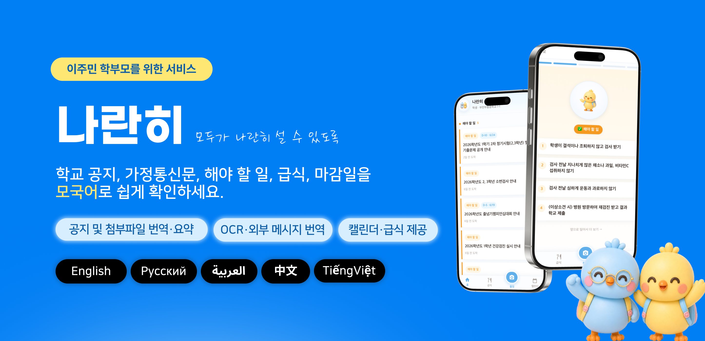

# 나란히



나란히는 한국어 학교 공지를 읽기 어려운 학부모가 자녀의 학교생활을 놓치지 않도록 돕는 다국어 학교생활 도우미입니다.

학교 홈페이지 공지, 가정통신문, 급식, 일정, 준비물, 제출 기한을 학부모가 이해하기 쉬운 언어와 카드 형태로 정리합니다. 단순 번역을 넘어 “무엇을 해야 하는지”, “언제까지인지”, “아이에게 필요한 준비물은 무엇인지”를 빠르게 확인할 수 있도록 설계했습니다.

## 어떤 문제를 해결하나요?

한국 학교 공지는 중요한 정보가 많지만, 한국어에 익숙하지 않은 학부모에게는 문장도 길고 학교 행정 표현도 낯설 수 있습니다. 자동 번역만으로는 제출 기한, 준비물, 행사 날짜, 주의사항처럼 실제 행동으로 이어져야 하는 정보를 놓치기 쉽습니다.

나란히는 학교 공지를 학부모 관점으로 다시 정리합니다. 공지의 핵심 내용을 카드로 나누고, 해야 할 일과 일정을 따로 표시하며, 급식과 알레르기·종교/식이 금기 정보까지 함께 보여줍니다.

## 주요 사용자

- 한국어 학교 공지 이해가 어려운 이주민 학부모
- 다문화 가정 및 국제결혼 가정의 보호자
- 외국인 근로자 자녀를 둔 보호자
- 학부모에게 학교 소식을 더 쉽게 전달하고 싶은 학교 관계자

## 핵심 기능

- **학교 공지 자동 정리:** 학교 홈페이지 공지를 가져와 핵심 내용, 준비물, 해야 할 일, 일정으로 나누어 보여줍니다.
- **다국어 번역:** 한국어, 영어, 아랍어, 러시아어, 중국어, 베트남어를 지원합니다.
- **카드뉴스형 공지 보기:** 긴 가정통신문을 학부모가 넘겨 보기 쉬운 카드 형태로 제공합니다.
- **홈 화면 요약:** 새 공지, 해야 할 일, 학교 소식을 한 화면에서 빠르게 확인합니다.
- **캘린더:** 공지에서 추출한 행사일, 제출 기한, 공개 기간 등을 월간 캘린더와 일정 목록으로 보여줍니다.
- **급식 정보:** NEIS 급식 데이터를 바탕으로 식단과 알레르기 정보를 표시합니다.
- **종교/식이 금기 경고:** 할랄, 돼지고기 제외, 쇠고기 제외, 채식, 코셔 설정에 따라 급식 메뉴에 경고를 표시합니다.
- **OCR 사진 번역:** 하이클래스, 카카오톡, 종이 안내문 이미지를 선택해 OCR로 읽고 번역합니다.
- **메시지 번역:** 학부모가 선생님께 보내고 싶은 문장을 한국어로 자연스럽게 번역합니다.

## 사용 흐름

1. 학부모가 로그인합니다.
2. 온보딩에서 자녀 학교, 학년, 반, 사용할 언어를 선택합니다.
3. 필요한 경우 아이별 알레르기와 종교/식이 금기 항목을 설정합니다.
4. 홈에서 최신 학교 공지와 해야 할 일을 확인합니다.
5. 공지 상세 화면에서 번역된 카드뉴스로 핵심 내용을 확인합니다.
6. 캘린더에서 행사 일정과 제출 기한을 확인합니다.
7. 급식 화면에서 식단, 알레르기, 종교/식이 금기 경고를 확인합니다.
8. 직접 받은 안내문 이미지는 촬영/OCR 화면에서 선택해 번역합니다.

## 화면별 안내

### 홈

홈은 학부모가 가장 먼저 보는 화면입니다. 자녀 학교 기준으로 새 공지, 해야 할 일, 일반 공지를 구분해 보여줍니다. 공지 제목을 누르면 상세 카드뉴스 화면으로 이동합니다.

### 공지 상세

긴 가정통신문을 요약 카드, 준비물 카드, 해야 할 일 카드, 일정 카드 등으로 나누어 보여줍니다. 학부모가 바로 행동해야 하는 내용은 별도 배지로 강조합니다.

### 캘린더

공지에 담긴 행사일, 제출 기한, 신청 기간을 월간 달력에서 한눈에 확인할 수 있습니다. 기출문제 공개 기간처럼 며칠 동안 이어지는 안내도 하나의 일정으로 정리되어, 언제 시작하고 언제 끝나는지 쉽게 파악할 수 있습니다.

### 급식

학교 급식 메뉴와 알레르기 정보를 확인할 수 있습니다. 아이에게 설정된 종교/식이 금기 항목이 있으면 메뉴명과 알레르기 코드를 함께 참고해 경고를 표시합니다.

지원하는 종교/식이 금기 항목은 다음과 같습니다.

- 할랄
- 돼지고기 제외
- 쇠고기 제외
- 채식
- 코셔

### 촬영/OCR

학부모가 별도로 받은 안내문 이미지를 선택하면 OCR로 글자를 읽고 선택한 언어로 번역합니다. 모바일에서는 이미 촬영해 둔 사진이나 캡처 이미지를 앨범에서 선택해 사용할 수 있습니다.

### 설정

언어, 자녀 정보, 종교/식이 금기 항목을 확인하고 수정할 수 있습니다. 언어 선택은 현재 서비스에서 지원하는 한국어, 영어, 아랍어, 러시아어, 중국어, 베트남어만 제공합니다.

## 지원 언어

| 언어 | 지원 |
|---|---|
| 한국어 | 기본 |
| 영어 | 지원 |
| 아랍어 | 지원, RTL 방향 적용 |
| 러시아어 | 지원 |
| 중국어 | 지원 |
| 베트남어 | 지원 |

## 기술 구성

| 영역 | 사용 기술 |
|---|---|
| 웹 앱 | Next.js, React, TypeScript |
| API 서버 | Next.js Route Handler, FastAPI |
| 데이터 | Supabase Postgres |
| 인증 | Supabase Auth |
| 파일 저장 | Supabase Storage |
| 학교 데이터 | 학교 홈페이지 공지 수집, NEIS 급식/시간표 연동 |
| AI 기능 | Gemini 기반 OCR, 공지 분석, 번역 |
| 배포 | Docker, GitHub Actions, Google Cloud Run |

## 로컬 실행

```bash
npm install
npm run dev
```

웹 앱은 기본적으로 `http://localhost:3000`에서 실행됩니다.

백엔드 API가 필요한 기능(OCR, 공지 분석, 번역 등)을 함께 확인하려면 FastAPI 서버도 실행합니다.

```bash
cd backend
python -m venv .venv
source .venv/bin/activate
pip install -r requirements.txt
uvicorn app.main:app --reload --port 8000
```

헬스체크:

```bash
curl http://localhost:3000/api/health
curl http://localhost:8000/health
```

## 환경 변수

로컬 환경 변수는 `.env.local`에 작성합니다. 공개 가능한 예시는 `.env.example`을 참고합니다.

```env
NEXT_PUBLIC_APP_NAME=Naranhi
NEXT_PUBLIC_SUPABASE_URL=https://your-project-ref.supabase.co
NEXT_PUBLIC_SUPABASE_ANON_KEY=your-supabase-anon-key
SUPABASE_SERVICE_ROLE_KEY=your-supabase-service-role-key
NEXT_PUBLIC_API_BASE_URL=http://localhost:8000
FASTAPI_INTERNAL_URL=http://localhost:8000
SUPABASE_URL=https://your-project-ref.supabase.co
CORS_ORIGINS=http://localhost:3000
NEIS_API_KEY=your-neis-api-key
```

## 데이터베이스와 배포

Supabase는 사용자 인증, 자녀/학교 정보, 공지 분석 결과, 번역 결과, 급식/설정 데이터를 관리합니다.

```bash
supabase link --project-ref your-project-ref
supabase db push
```

배포는 GitHub Actions와 Google Cloud Run을 기준으로 구성되어 있습니다. 웹 앱과 FastAPI 서버는 각각 컨테이너로 배포됩니다.

## 관련 문서

- [FastAPI Service](docs/backend/fastapi.md)
- [Scheduled Crawl Runbook](docs/scheduled-crawl-runbook.md)
- [Agent Workflow](docs/agent-workflow.md)

## 라이선스

추후 작성 예정입니다.
